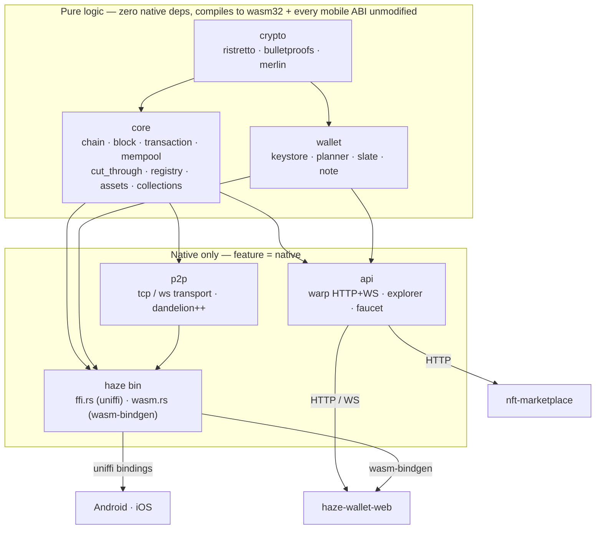
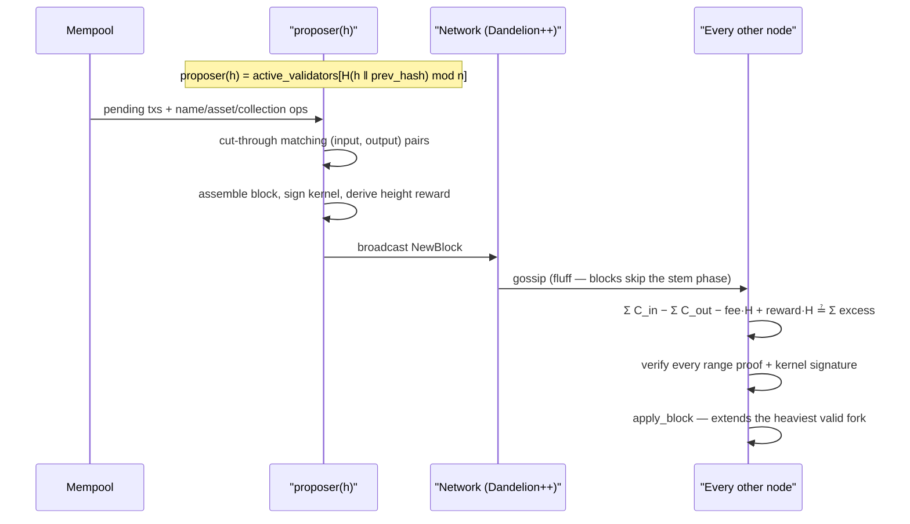
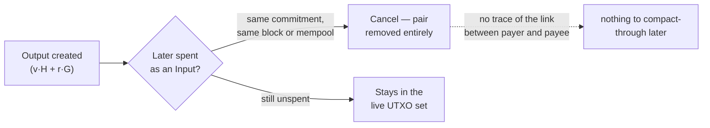

# haze

[](https://github.com/Pranav00x/haze/actions/workflows/ci.yml)
[](LICENSE)
[](Cargo.toml)
[](https://haze-b3l9.onrender.com/v1/status)
[](https://haze-b3l9.onrender.com/v1/status)
[](https://haze-b3l9.onrender.com/v1/status)

### 👀 something's coming.

A privacy-first L1 built on Mimblewimble — no smart contracts, no accounts, no on-chain history for who paid who. NFTs, drops, and a trustless marketplace already run natively on it.

**Testnet drops soon.** Watch this space. The badges above are live — they query the running node's `/v1/status` directly, not a fixed number in this file.

---

## Architecture



## Block production

Deterministic single-proposer-per-height PoS — no leader election round trip, no BFT voting, the whole network computes the same answer independently:



## Cut-through, visually



A Mimblewimble L1, devnet stage. This is a technical reference, not a pitch — it assumes you already know what a Pedersen commitment and a Fiat–Shamir transcript are.

## State model

UTXO set only. No accounts, no global balance ledger.

**Output** := `(C, π, ξ)`
- `C = v·H + r·G` — Pedersen commitment, ristretto255
- `π = Bulletproofs::RangeProof(v, r)` — proves `v ∈ [0, 2^64)`, no trusted setup
- `ξ = ChaCha20Poly1305(note_key, idx‖v)` — optional recoverable note (`wallet::note`)

**Kernel** := `(excess, fee, σ)`
- `excess = Σ r_in − Σ r_out`, committed to value 0
- `σ = Schnorr(excess_sk, fee_LE)` — Fiat–Shamir transcript via `merlin`

Validity, checked in `core::transaction::validate_with_reward`:
- `Σ C_in − Σ C_out − fee·H + reward·H ≟ Σ excess_i`
- every output: `RangeProof.verify(C, π)`
- every kernel: `σ.verify(fee_LE, excess)`

## Cut-through

Per-block and mempool-wide: any `(input, output)` pair on matching commitments cancels, regardless of arrival order. Horizon compaction (`core::compaction`, default 1000-block window) prunes spent in/out pairs below the horizon without invalidating tip-relative kernel-sum verification.

Compacted peers can't serve full historical re-validation past their horizon — see `PrunedRange` in `p2p::message` and `earliest_full_height()`.

## Consensus

PoS, deterministic proposer selection per height:

```
proposer(h) = active_validators[ H(h ‖ prev_hash) mod |active_validators| ]
```

A validator is a revealed `(commitment, value, blinding)` for an already-mined, currently-unspent output. There's no separate stake-lock UTXO type — spending that exact output retroactively deregisters the validator (`core::chain.rs`, `active_validators.retain` on input match). No slashing.

## Registries

Non-confidential, first-write-wins, separate namespaces:

| | module | ops |
|---|---|---|
| `.haze` names | `core::registry` | `RegisterNameOp` / `TransferNameOp` |
| assets ("NFTs") | `core::assets` | `MintAssetOp` / `TransferAssetOp` |

Both are committed into `BlockHeader` via a flat sorted-hash root (sort by key, concat, hash — not a Merkle tree, no membership proofs yet). Ownership is keyed by the wallet's stable `identity_key`, shared across both registries. Both deliberately skip Dandelion (see Network) — ownership is public by construction, there's no anonymity set to protect.

## Network

Transport-agnostic by construction (`p2p::transport::{PeerReader, PeerWriter}`):

- **Tcp** — raw length-prefixed bincode, `u32` LE prefix, ≤32 MiB/msg
- **WsServer** — `warp::ws()`, inbound-only, rides the node's existing HTTP(S) port (`GET /v1/p2p/ws`) — for hosts that only proxy one port
- **WsClient** — `tokio-tungstenite`, outbound-only, dialed when a `--peers` entry has a `ws(s)://` prefix

Payment gossip is Dandelion++ (20% fluff probability per hop, 15s fallback-fluff timer). A locally-originated tx enters the stem phase exactly like a relayed hop (`p2p::server::dispatch_dandelion_tx`) — flat-broadcasting a local tx would make the originating node trivially distinguishable from a relay, defeating the entire point.

Sync: `Handshake → ChainInfo → GetBlocks(from_height) → BlocksBatch`, 256 blocks/round. Reorg via `rollback_block` + height-keyed `validator_snapshots`. `active_validators` isn't part of block history (mutated only by live `RegisterValidator`) — synced separately via `GetValidators`/`ValidatorsList` after block sync completes.

## Crypto stack

`curve25519-dalek-ng` (ristretto group), `bulletproofs`, `merlin` (Fiat–Shamir transcripts), `sha2`, `chacha20poly1305`, `bip39`. `rustls` (aws-lc-rs backend) for the wasm/ws-client TLS path. Zero pairing-based crypto anywhere in the tree.

## Build surface

Cargo feature `native` gates every OS-dependent dep: `sled`, `warp`, `reqwest`, `clap`, `uniffi`, `tokio`, `tokio-tungstenite`, `futures-util`. Everything under `core::{chain,block,transaction,genesis,mempool,cut_through,registry,assets}`, `crypto::*`, and `wallet::{keystore,store,planner,slate}` is pure logic with zero native dependencies — the same source compiles to `wasm32-unknown-unknown` and every mobile ABI unmodified.

Targets exercised in CI / the release matrix:

- `x86_64-unknown-linux-gnu`, `x86_64-pc-windows-msvc`
- `x86_64-apple-darwin`, `aarch64-apple-darwin`
- `aarch64-linux-android`, `armv7-linux-androideabi`, `{i686,x86_64}-linux-android`
- `wasm32-unknown-unknown`

## Threat model / known gaps

- Genesis validator/faucet/vesting secrets are real out-of-band scalars, not present in this repo — one deliberate exception: the devnet genesis stake/claim output uses `blinding=42`, intentionally public (see `genesis.rs` module doc).
- Devnet. Resets happen without notice. Treat every balance as fake.
- Fungible multi-asset support was scoped **out** after analysis: a per-asset Pedersen generator scheme (`C = v·H_asset + r·G`) preserves the balance-equation security, but range-proof verification still needs the verifier to know which generator applies per output — i.e. a public per-output asset tag. That's a real confidentiality regression versus HAZE-only, not fixable within this dependency stack without a from-scratch Confidential-Assets-grade construction (blinded generator + surjection proof). NFTs (this repo's asset registry) don't have this problem: ownership was already public.
- Registry roots are flat hashes, not Merkle — no compact membership proofs for light clients yet.
- Block/tx propagation to a non-proposing peer works (Dandelion + mixed TCP/WS transport, verified live), but there's still no SPV/light-client sync mode — every node holds full (or horizon-compacted) chain state.

## Verify

```
cargo build --release
cargo test --release                                    # 80 tests
wasm-pack build --target web --features wasm --no-default-features
cargo ndk -t arm64-v8a build --release --lib --no-default-features --features native
```

## License

MIT
